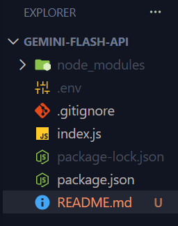
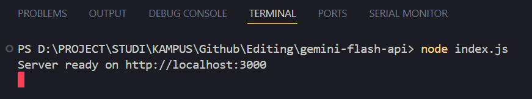
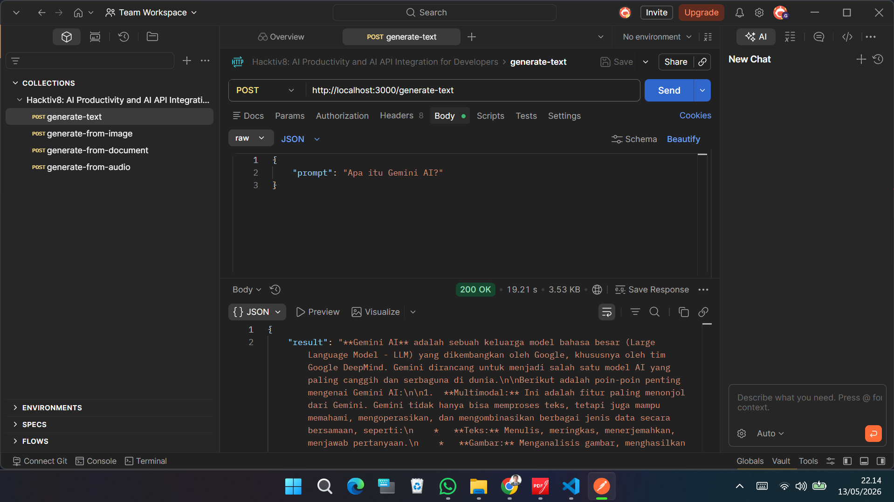
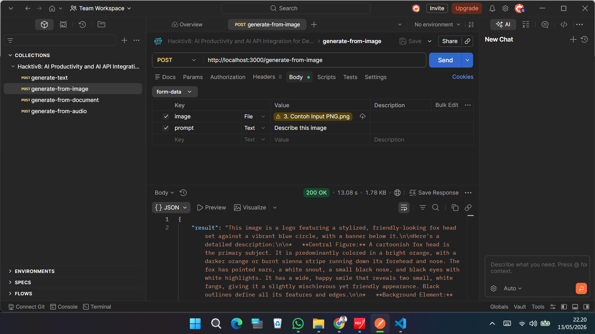
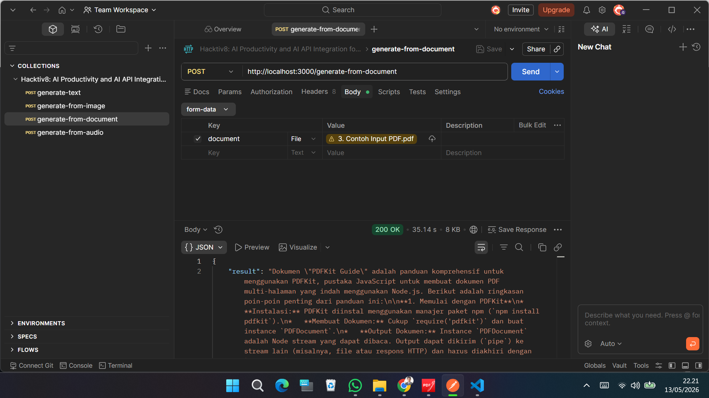
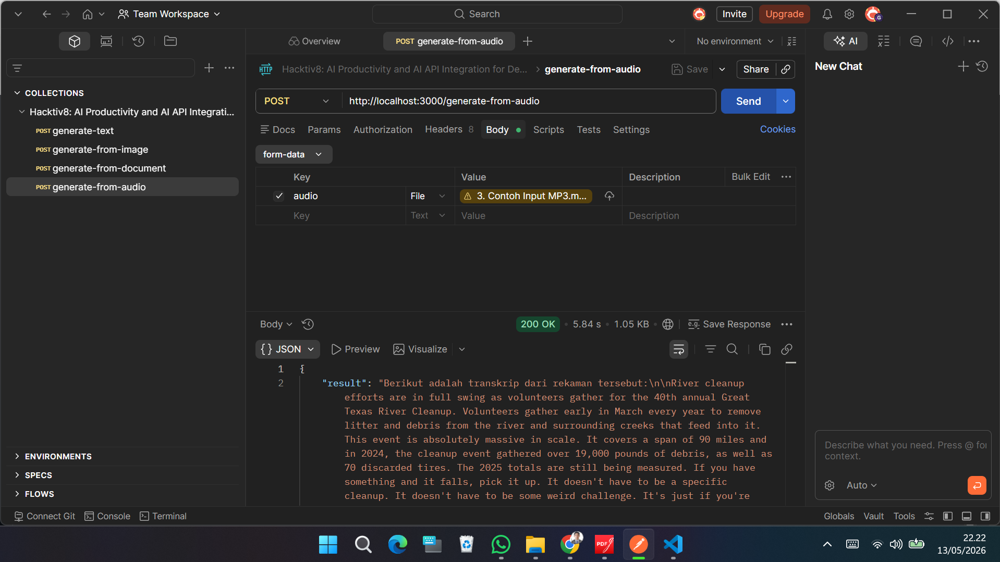

[](https://github.com/ellerbrock/open-source-badges/)


# gemini-flash-api
Tugas Session 2 – ``` Hacktiv8: AI Productivity and AI API Integration for Developers ```

<br><br>

## 📁 Explorer: Project Folder and File Structure
<table>
<tr>
<td width="840"></td>
</tr>
</table>

<br><br>

## 🖥️ Terminal: Running the Node.js Server
<table>
<tr>
<td width="840"></td>
</tr>
</table>

<br><br>

## ⚡ Postman: Testing the API Endpoints
<table>
<tr>
<td width="210"></td>
<td width="210"></td>
<td width="210"></td>
<td width="210"></td>
</tr>
</table>